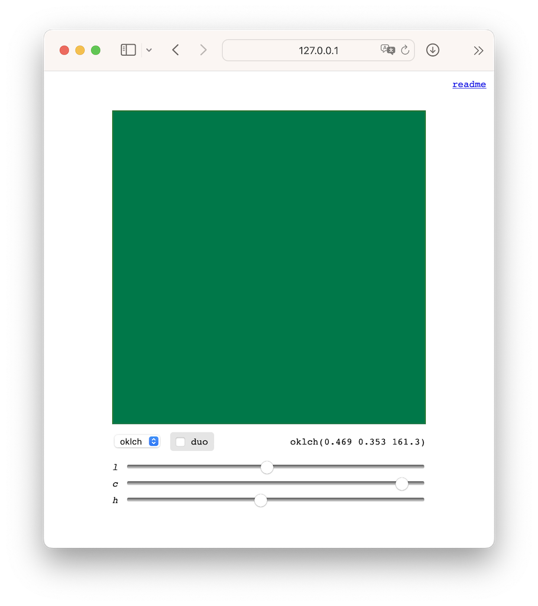

# color swatch

A small open source tool to pick colors from an image. Features:

- Color picker in OKLCH, LCH, HSL, RGB
- Minimal interface
- Copy + paste colors with `Cmd/Ctrl + C` and `Cmd/Ctrl + V`
- Duo swatch mode for color interaction tests

Currently desktop only.

## demo

https://mattdesl.github.io/colorswatch

## To use

Open [the app](https://mattdesl.github.io/colorswatch) and start changing colors with the sliders. Hit `Cmd/Ctrl + C` to copy the color string, or `Cmd/Ctrl + V` to paste a color string into the app and change the color to it.

Type `R` key to randomize all three color coordinates, or `1`, `2`, `3` keys to randomize individual coordinates.

Check the `duo` box to enable a second color, for interaction testing. Click on either color to select and 'activate' it for the sliders and keystroke functionality.

## credits

Thanks to [Colorjs.io](https://colorjs.io/) for color functions.

## related

Also see [colorgrab](https://mattdesl.github.io/colorgrab/).
